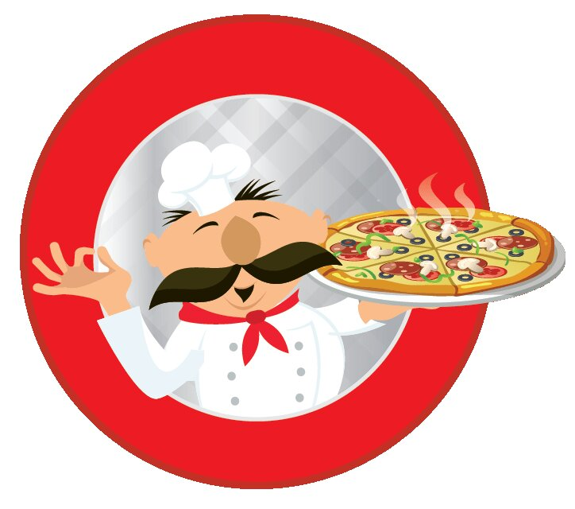

<h1 style="text-align: center;"> Pizzeria lui Gigel </h1>

Prietenul nostru *Gigel* s-a hotărât să își deschidă o pizzerie. Cum Gigel nu știe programare are nevoie de voi pentru a realiza o aplicație care să ruleze în linie de comandă ca să își poată satisface inclusiv clienții cărora nu le place să aibă o interfața grafică și lucrează doar în terminal.
Pizzeria lui Gigel este una micuță momentan aceasta poate prepara doar 3 tipuri de pizza: Margherita, Cheesy și Dracula. Toate cele 3 tipuri de pizza pot avea doua dimensiuni: Medie (30 cm) sau Mare (50 cm) și 2 tipuri de blat: Subțire și Pufos. Prețul fiecărei Pizza se calculează în funcție de diametru și tipul de blat astfel: Diametru * TipBlat (Subtire va fi reprezentat prin numarul 2, iar Pufos prin numarul 3) / 4. De asemenea pentru fiecare tip de pizza se va adauga un adaos specific: pentru Margherita +5.99, pentru Cheesy + 7.99, pentru Dracula + 8.99. 
Un client care folosește doar linia de comandă va avea posibilitatea să listeze tipurile de pizza, să comande mai multe pizza sau să închidă aplicația. În urma realizării acestei implementări Gigel vă va rămâne profund îndatorat neputând să vă răsplătească vreodată pentru bunătatea dovedită în scrierea acestei aplicații.